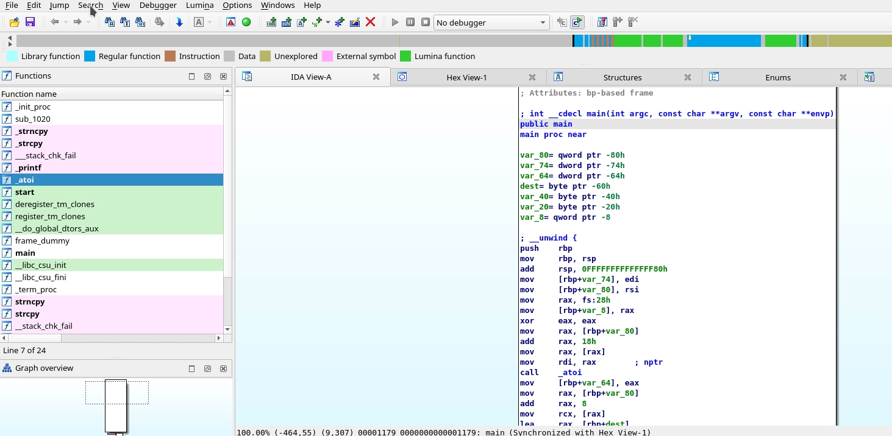
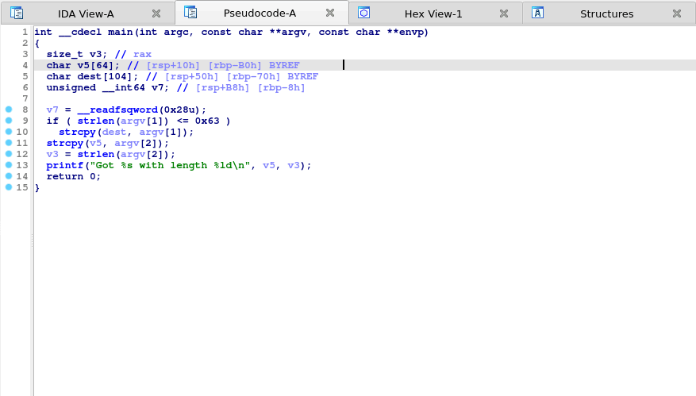

# VulFi v2.1

## Introduction 

The VulFi (Vulnerability Finder) tool is a plugin to IDA Pro which can be used to assist during bug hunting in binaries. Its main objective is to provide a single view with all cross-references to the most interesting functions (such as `strcpy`, `sprintf`, `system`, etc.). For cases where a Hexrays decompiler can be used, it will attempt to rule out calls to these functions which are not interesting from a vulnerability research perspective (think something like `strcpy(dst,"Hello World!")`). Without the decompiler, the rules are much simpler (to not depend on architecture) and thus only rule out the most obvious cases.

## Installation

Place the `vulfi.py`, `vulfi_prototypes.json` and `vulfi_rules.json` files in the IDA plugin folder (`cp vulfi* <IDA_PLUGIN_FOLDER>`).

## Preparing the Database File

Before you run VulFi make sure that you have a good understanding of the binary that you work with. Try to identify all standard functions (`strcpy`, `memcpy`, etc.) and name them accordingly. The plugin is case insensitive and thus `MEMCPY`, `Memcpy` and `memcpy` are all valid names. However, note that the search for the function requires exact match. This means that `memcpy?` or `std_memcpy` (or any other variant) will not be detected as a standard function and therefore will not be considered when looking for potential vulnerabilities. If you are working with an unknown binary you need to set the compiler options first `Options` > `Compiler`. After that VulFi will do its best to filter all obvious false positives (such as call to `printf` with constant string as a first parameter). Please note that while the plugin is made without any ties to a specific architecture some processors do not have full support for specifying types and in such case VulFi will simply mark all cross-references to potentially dangerous standard functions to allow you to proceed with manual analysis. In these cases, you can benefit from the tracking features of the plugin.

## Usage

### Scanning

To initiate the scan, select `Search` > `VulFi` option from the top bar menu. This will either initiate a new scan, or it will read previous results stored inside the `idb`/`i64` file. The data are automatically saved whenever you save the database.

Once the scan is completed or once the previous results are loaded a table will be presented with a view containing following columns:
* **IssueName** - Used as a title for the suspected issue.
* **FunctionName** - Name of the function.
* **FoundIn** - The function that contains the potentially interesting reference.
* **Address** - The address of the detected call.
* **Status** - The review status, initial `Not Checked` is assigned to every new item. The other statuses are `False Positive`, `Suspicious` and `Vulnerable`. Those can be set using a right-click menu on a given item and should reflect the results of the manual review of the given function call.
* **Priority** - An attempt to prioritize more interesting calls over the less interesting ones. Possible values are `High`, `Medium` and `Low` (also `Info` for cases where the scanner was not able to identify all parameters properly). The priorities are defined along with other rules in `vulfi_rules.json` file.
* **Comment** - A user defined comment for the given item.

In case that there are no data inside the `idb`/`i64` file or user decides to perform a new scan. The plugin will ask whether it should run the scan using the default included rules or whether it should use a custom rules file. Please note that running a new scan with already existing data does not overwrite the previously found items identified by the rule with the same name as the one with previously stored results. Therefore, running the scan again does not delete existing comments and status updates.



In the right-click context menu within the VulFi view, you can also remove the item from the results or remove all items. Please note that any comments or status updates will be lost after performing this operation. 
As of version 2.1, VulFi also supports operations performed on multiple selected items at once. This allows multiple items to be marked with certain status, deleted or same comment added to multiple rows. Sometimes it happens that the operation does not refreshe correctly. When this occurs, refresh the UI (`Ctrl+U`) couple times until you see the changes reflected.

### Investigation

Whenever you would like to inspect the detected instance of a possible vulnerable function, just double-click anywhere in the desired row and IDA will take you to the memory location which was identified as potentially interesting. Using a right-click and option `Set Vulfi Comment` allows you to enter comment for the given instance (to justify the status for example).

### Adding More Functions

The plugin also allows for creating custom rules. These rules could be defined in the IDA interface (ideal for single functions) or supplied as a custom rule file (ideal for rules that aim to cover multiple functions).

#### Within the Interface

When you would like to trace a custom function, which was identified during the analysis, right-click anywhere within its body and select `Add <name> function to VulFi`. You could also highlight and right-click a function name within current disassembly/decompiler view to avoid switching into the function body.



#### Custom Set of Rules

It is also possible to load a custom file with set of multiple rules. To create a custom rule file with the below structure you can use the included template file [here](./rule_template_file.json).

```json
[   // An array of rules
    {
        "name": "RULE NAME", // The name of the rule
        "function_names":[
            "function_name_to_look_for" // List of all function names that should be matched against the conditions defined in this rule
        ],
        "wrappers":true,    // Look for wrappers of the above functions as well (note that the wrapped function has to also match the rule)
        "mark_if":{
            "High":"True",  // If evaluates to True, mark with priority High (see Rules below)
            "Medium":"False", // If evaluates to True, mark with priority Medium (see Rules below)
            "Low": "False" // If evaluates to True, mark with priority Low (see Rules below)
        }
    }
]
```

An example rule that looks for all cross-references to function `malloc` and checks whether its paramter is not constant and whether the return value of the function is checked is shown below:

```json
{
    "name": "Possible Null Pointer Dereference",
    "function_names":[
        "malloc",
        "_malloc",
        ".malloc"
    ],
    "wrappers":false,
    "mark_if":{
        "High":"not param[0].is_constant() and not function_call.return_value_checked()",
        "Medium":"False",
        "Low": "False"
    }
}
```

### Rules

#### Available Variables

* `param[<index>]`: Used to access the parameter to a function call (index starts at `0`)
* `function_call`: Used to access the function call event
* `param_count`: Holds the count of parameters that were passed to a function

#### Available Functions

* Is parameter a constant: `param[<index>].is_constant()`
* Get numeric value of parameter: `param[<index>].number_value()`
* Get string value of parameter: `param[<index>].string_value()`
* Is parameter set to null after the call: `param[<index>].set_to_null_after_call()`
* Is return value of a function checked: `function_call.return_value_checked(<constant_to_check>)`
* Is the parameter also used as a parameter in one of the calls to a specified list of functions before/after: `param[<index>].used_in_call_<before|after>(["function1","function2"])`
* Is the call to the selected function reachable from a specific other function: `function_call.reachable_from("<function_name>")`

#### Examples

* Mark all calls to a function where third parameter is > 5: `param[2].number_value() > 5`
* Mark all calls to a function where the second parameter contains "%s": `"%s" in param[1].string_value()`
* Mark all calls to a function where the second parameter is not constant: `not param[1].is_constant()`
* Mark all calls to a function where the return value is validated against the value that is equal to the number of parameters: `function_call.return_value_checked(param_count)`
* Mark all calls to a function where the return value is validated against any value: `function_call.return_value_checked()`
* Mark all calls to a function where none of the parameters starting from the third are constants: `all(not p.is_constant() for p in param[2:])`
* Mark all calls to a function where any of the parameters are constant: `any(p.is_constant() for p in param)`
* Mark all calls to a function: `True`
* Mark all calls to a function where the second paramter is not constant and is not checked with `strlen`: `not param[1].is_constant() and not param[1].used_in_call_before(["strlen"])`
* Mark all calls to a function which are reachable from `read` function: `function_call.reachable_from("read")`

### Issues and Warnings

* When you request the parameter with index that is out of bounds any call to a function will be marked as `Low` priority. This is a way to avoid missing cross references where it was not possible to correctly get all parameters (this mainly applies to disassembly mode).
* When you search within the VulFi view and change context out of the view and come back, the view will not load. You can solve this either by terminating the search operation before switching the context, moving the VulFi view to the side-view so that it is always visible or by closing and re-opening the view (no data will be lost).
* Scans for more exotic architectures end with a lot of false positives.
* With addition of multi-select operations in the VulFi chooser, the refresh operations sometimes fails to update the view. If you notice that your changes were not reflected, use `Ctrl+U` shortcut ot manually refresh the view (couple times).