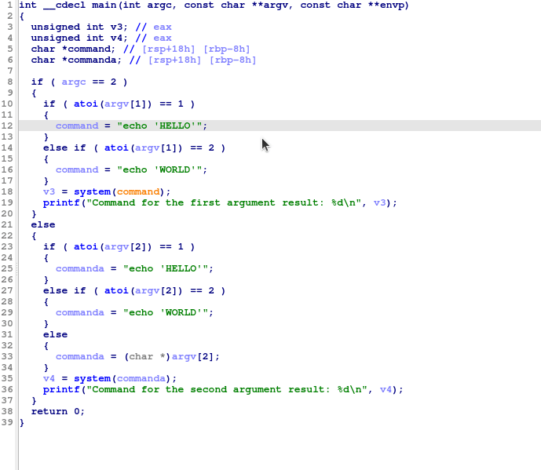

# Version 2.1

## Quality of life improvements

* Within the VulFi view, you can now use multi-select operations (in case that you do not see the changes take effect press `Ctrl+U` with any item selected to manually refresh the view). This allows to perform operations such as deletion, status changes or adding comments on multiple rows at once. (Also `Purge All Results` command was removed as it makes no sense at this point)

* It is now possible to export results in comma-separated CSV format and JSON. When starting new scan via `Search > Vulfi` menu item, you can now select `Import` action and use previously exported `JSON` file. Please note that it is neccessary to have exactly the same offsets within the file. Therefore, it is recommended to share the whole database.

# Version 2.0

## Quality of life improvements

You can now highlight and right-click a function name to trace it in both disassembly and decompiler view. This eliminates the need to go into the disassembly view of the function you want to trace and thus should be less disruptive to your workflow.

## Improvements of existing features

The VulFi now looks for constants that are passed through a variable in decompiler (when for example based on condition you execute different OS command through a call to `system` function, but in both cases this command is static). To achieve this a basic check of the flow of the code was added. See example below:

## New features

* Added possibility to look for the use of the parameter in other function calls both before and after the traced call. This can be useful to for example find all occurrences of `strcpy` where the value of the `src` argument was not checked with `strlen` call.
* Added possibility to find whether the call to a function is reachable from other specific function. This is useful in situations where you know about certain input processing function and you want to find out whether any of the calls to `system` function is reachable from that location (does not use HexRays at all but requires IDA to properly resolve XREFs).

## Others

Updated and new features were reflected in the default set of rules that ships within this repository.

Updated the plugin to not require definition of function names with underscore and dot (default rules file updated).
