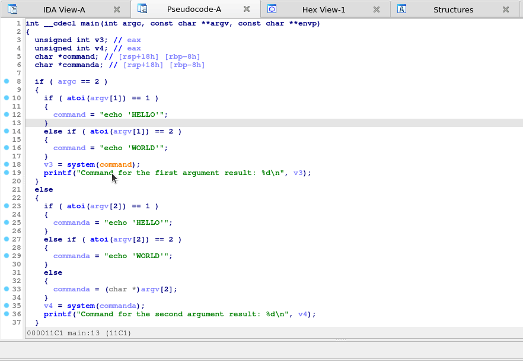

# Version 2.0

## Quality of life improvements

You can now highlight and righ-click a function name to trace it in both disassembly and decompiler view. This eliminates the need to go into the dissassembly view of the function you want to trace and thus should be less disruptive to your workflow.

## Improvements of existing features

The VulFi now looks for constants that are passed through a variable in decompiler (when for exmaple based on condition you execute different OS command through a call to `system` function, but in both cases this command is static). To achieve this a basic checks the flow of the code were added. See example below:

## New features

Added possibility to look for the use of the paramter in other function calls both before and after the traced call. This can be useful to for example find all occurances of `strcpy` where the value of the `src` argument was not checked with `strlen` call.

## Others

Updated and new features were reflected in the default set of rules that ships within this repository. You can investigate all the changes here: TODO

Performance improvment by caching decompilation results.